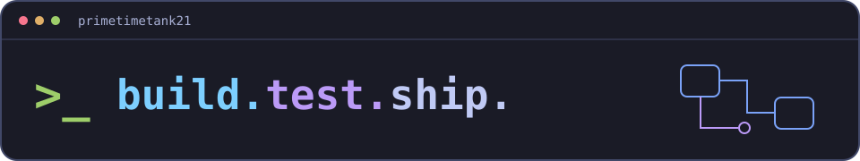

  

<h1 align="center">Hey, I'm Earl.</h1>

<strong>Software Engineer 2 at Microsoft · MAIDAP</strong>

I build software from prototype toward production, with a focus on clear interfaces, useful automation, and tests that make changes easier to trust.

  <a href="https://primetimetank21.github.io/">Portfolio &amp; project stories</a> · <a href="https://www.linkedin.com/in/earl-tankard-jr/">LinkedIn</a>

## Technical focus

Python, TypeScript/JavaScript, and C++ · APIs, developer tooling, and web interfaces.

## Outside of work

Video games, working out, and sharpening my Spanish.

Explore the pinned repositories below for code and experiments.

