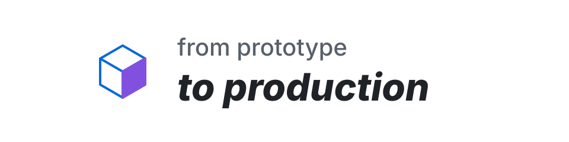

  <picture>
    <source media="(prefers-color-scheme: dark)" srcset="./assets/profile-banner-dark.svg" />
    <source media="(prefers-color-scheme: light)" srcset="./assets/profile-banner-light.svg" />
    
  </picture>

<h1 align="center">Hey, I'm Earl.</h1>

<strong>Software Engineer 2 at Microsoft · MAIDAP</strong>

I build useful tools—and care about the details that make them dependable.

  <a href="https://primetimetank21.github.io/">Portfolio &amp; project stories</a> · <a href="https://www.linkedin.com/in/earl-tankard-jr/">LinkedIn</a>

  
  
  
  

APIs · Developer tooling · Web interfaces

🎮 Video games · 💪🏾 Working out · 🇪🇸 Spanish practice

